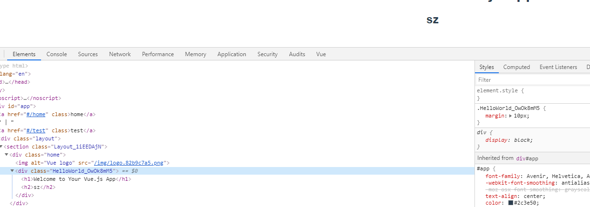

# CSS 规范

## 通用

1. View 目录下的业务`page`才用 css-module
2. 通用 `common` ,系统级别样式采用`less`

## css-module

> vue.config.js 配置

```js

css: {
    requireModuleExtension: true,
    loaderOptions: {
        css: {
            modules: {
            localIdentName: '[name]_[hash:base64:8]'},
            localsConvention: 'camelCaseOnly'
        }
    }
}

```

使用

```vue
<template>
  <div :class="hello.container"></div>
</template>
<script lang="ts">
import { Component, Prop, Vue } from 'vue-property-decorator'

@Component({})
export default class HelloWorld extends Vue {}
</script>

<style module>
.container {
  margin: 10px;
}
</style>
```

解析结果



## less

1 `styles`目录下创建

```
  |styles
  |--- transition.less
  |--- common.less
  |--- index.less

```
